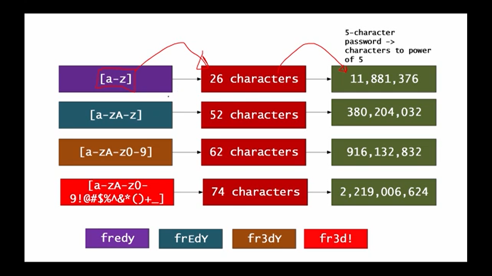

# password Strength Checker
## calculate the strength of your password and time to crack your password.
*Take input as your password.
*shows the time it will take to crack password using brute force method.
*Chacracter and Digits plays important role in password strength level.
##### [Check password strength here](https://99b5p.csb.app/)
### How password strength is calculated?
Strength of your password depends on three Factor:-
* The no of character you have in your password.eg:- lowercase(a-z), uppercase(A-Z), number(0-9) and symbols(!@#$%^&*(_)+=).
* How many digits your password have.eg:- 4 digits(asdf), 5 digits(4sdjg) etc.
* how many passwords can be cracked in a second using Brute-force method.
[click here](https://asecuritysite.com/encryption/passes) for details.

### Explanation:-
* If your password has only lower case it means maximum 26 characters is posssible and the digits will be the power 26 and the result would be the maximum password combinations 
 lower case:- 26^digit= max password combination for lower case
 include uppercase:- 52^digit= max password combination for both lower and upper.
 include number:- 62^digit= max possible password combinations.
 include symbols:- 72^digits will be max password combination including lower case, uppercase, number and symbols.
 .

### Examples:-
* suppose you entered a lower case password of 5 digits then the max password combination would be:- 26^5= 11,881,376 password combinatoin
now let say we have a computer who can crack 1millions password / seconds, 
then 11,881,376/1,000,000 = ~ 11 sec.
it means it would take 11 sec to crack password for lowercase 5 digits.
* let add uppercase also then the equation would be :-52^5=380,204,032
here we added uppercase means max combination would be 26 for [A-Z] 
it would take 380,204,032/1,000,000= 380 sec or 6.3 minutes.
as we added a uppercase for same 5 digit password.
* let add number character in password along with upper two:-
equation would be  62^5=916,132,832 password combinations.
time taken to crack= 916,132,832/1,000,000= 916 seconds or ~15minutes.
* lets add symbol in the password then equation would be:-
74^5=2,219,006,624 passsword combination for 5 digit.
time taken to crack= 2,219,006,624/1,000,000= 2219 sec or ~37 minutes.

### Note:-
* more character in password more is the strength.
* more is the digit more it will be secure.
* higher is the brute force generator less time it will take to crack your password

